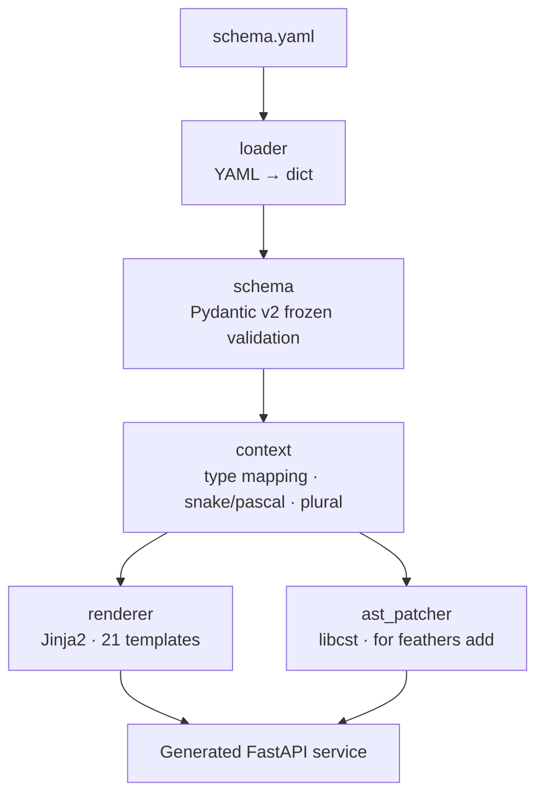
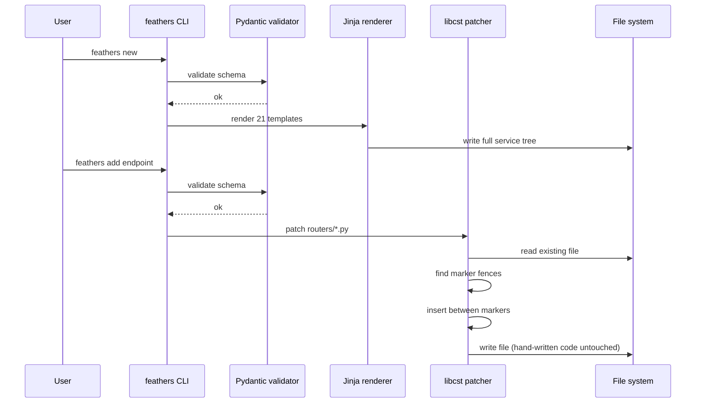
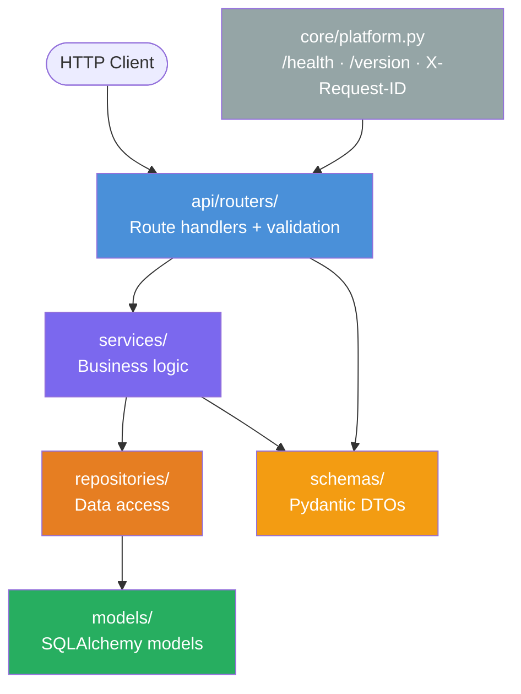
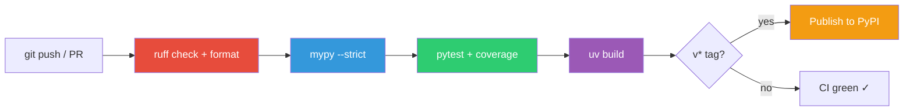

# 🪶 `feathers`

> ⚡ **Scaffold production FastAPI services from one YAML file — in under 10 seconds.**
> Incremental codegen that never clobbers your hand-written code.

🔗 [PyPI](https://pypi.org/project/feathers-cli/) · 📖 [Why](WHY.md) · 🏗️ [Architecture](docs/ARCHITECTURE.md) · 🎬 [Demo](docs/DEMO.md) · 📄 [Schema Example](src/feathers/demos/users.yaml)


---

```console
$ pip install feathers-cli

$ feathers new --schema demos/users.yaml --name hello-users --out .
✔ Validated schema (3 models, 5 endpoints)
✔ Rendered 21 templates
✔ Wrote hello-users/

$ cd hello-users && make run
INFO:     Uvicorn running on http://0.0.0.0:8000
INFO:     Application startup complete.

$ feathers add endpoint --schema demos/users.yaml --service ./hello-users
✔ Patched routers/user.py (hand-written code untouched)
```

---

## 💡 Why this exists

Most scaffolders give you a **dead tree the moment you touch it** — one regeneration and your edits are gone. `feathers` is different:

- **Incremental AST codegen** via `libcst` — `feathers add` slots new code into existing services without clobbering a single line you wrote.
- **Fence markers** (`# feathers: begin hand-written`) protect your code forever.
- **Pydantic v2 frozen models** validate every schema before a single file is written — if the schema is wrong, nothing gets generated.
- **One YAML file** produces a fully wired FastAPI service: tests, migrations, observability, CI, Docker, and platform middleware — all production-ready.

---

## ✨ Features

- 🏗️ **Full service generation** — 21 Jinja2 templates produce a complete FastAPI project
- 🔄 **Incremental codegen** — `feathers add endpoint` uses libcst AST rewriting, not string replacement
- 🛡️ **Fence markers** — hand-written code between `# feathers: begin hand-written` fences is never touched
- ✅ **Schema-first** — Pydantic v2 frozen models validate YAML before any file is written
- 📊 **Observability built-in** — Prometheus metrics, OpenTelemetry tracing, structlog logging
- 🐳 **Docker + CI** — Dockerfile, GitHub Actions workflow, Render deploy config
- 🩺 **Health checks** — `/health` and `/version` endpoints with platform middleware
- 🔍 **Schema linting** — `feathers lint` validates without generating
- 🩻 **Doctor command** — `feathers doctor` checks your environment

---

## 🔧 How it works



### `new` vs `add`



### Generated service MVC architecture

Every generated service follows strict MVC layering — no layer reaches across:



### CI/CD pipeline



See [`docs/ARCHITECTURE.md`](docs/ARCHITECTURE.md) for the deep dive.

---

## 📄 Schema anatomy

```yaml
service:
  name: hello_users
  description: A minimal users service
  python: "3.12"

models:
  - name: User
    fields:
      - { name: id,       type: uuid,     primary: true }
      - { name: email,    type: str,      unique: true, indexed: true }
      - { name: name,     type: str }
      - { name: created,  type: datetime }
    soft_delete: true
    audit: true

endpoints:
  - { method: GET,  path: /users/{id}, handler: user.get,    auth: any }
  - { method: POST, path: /users,      handler: user.create, auth: admin }
  - { method: GET,  path: /users,      handler: user.list,   auth: any, paginate: cursor }

observability:
  metrics: prometheus
  tracing: otel
  logging: structlog

deploy:
  target: render
  min_instances: 1
  health: /health
```

Every field is validated by **frozen Pydantic v2 models** — if the schema is wrong, `feathers` refuses to write a single file.

---

## 📁 Project structure

```
feathers/
├── src/feathers/
│   ├── cli.py                       # Typer CLI entry point
│   ├── generator/
│   │   ├── ast_patcher.py           # libcst AST rewriting for feathers add
│   │   ├── context.py               # Type mapping, naming transforms
│   │   └── renderer.py              # Jinja2 template rendering
│   ├── schema/
│   │   ├── loader.py                # YAML → dict I/O
│   │   ├── service.py               # Pydantic v2 frozen models
│   │   └── errors.py                # Schema validation errors
│   ├── templates/service/           # 21 Jinja2 templates
│   │   ├── src/                     # App, routers, services, repos, models, schemas
│   │   ├── tests/                   # Generated test files
│   │   ├── Dockerfile.j2
│   │   ├── Makefile.j2
│   │   ├── pyproject.toml.j2
│   │   ├── ci.yml.j2
│   │   └── render.yaml.j2
│   └── demos/                       # Example YAML schemas
├── tests/
│   ├── unit/
│   │   ├── test_ast_patcher.py
│   │   ├── test_cli.py
│   │   ├── test_context.py
│   │   ├── test_renderer.py
│   │   └── test_schema.py
│   └── e2e/
│       └── test_generate_and_run.py # Generates service, boots it, hits /health
├── .github/workflows/ci.yml
├── Makefile
├── pyproject.toml
└── WHY.md
```

### Generated service layout

```
hello-users/
├── src/hello_users/
│   ├── main.py                  # FastAPI app + middleware
│   ├── api/routers/             # One router per model
│   ├── services/                # Business logic layer
│   ├── repositories/            # Data access layer
│   ├── models/                  # Dataclass stubs (SQLAlchemy wiring in v0.2)
│   ├── schemas/                 # Pydantic DTOs
│   └── core/
│       └── platform.py          # /health, /version, X-Request-ID, X-Platform-Token
├── tests/
│   └── test_health.py
├── .github/workflows/ci.yml     # lint → test → build
├── Dockerfile
├── Makefile                     # make run | test | lint | format | typecheck
├── render.yaml                  # one-click Render deploy
└── pyproject.toml               # uv-managed
```

---

## 💻 CLI reference

| Command | Purpose |
|---|---|
| `feathers new --schema FILE --name NAME --out DIR` | Generate a new service from a schema |
| `feathers add endpoint --schema FILE --service DIR` | Slot a new endpoint into an existing service |
| `feathers add model --schema FILE --service DIR` | Add a new model stub |
| `feathers lint SCHEMA` | Validate a YAML schema without generating |
| `feathers doctor` | Environment health check (Python, uv) |
| `feathers bench` *(v0.2)* | Run Locust benchmarks against a generated service |

### Why it's different

| Most scaffolders | `feathers` |
|---|---|
| Cookiecutter templates — stale after first edit | **Incremental AST codegen** — regeneration stays safe forever |
| String templating | **Pydantic v2 schema** validated before any file is written |
| Hand-wired middleware per service | **Platform middleware** shipped with every generated service |
| You protect your edits with prayer | **Fence markers** — regen never touches protected regions |
| Pick your own stack | **Opinionated & consistent** — FastAPI + uv + Alembic + structlog + Prometheus + OTel |

---

## 🧱 Stack

| Concern | Choice |
|---|---|
| CLI framework | **Typer** |
| YAML validation | **Pydantic v2** (frozen models) |
| Template engine | **Jinja2** (21 templates per service) |
| AST rewriting | **libcst** |
| Package manager | **uv** |
| Lint / Types | **ruff** + **mypy strict** |
| Tests | **pytest** + coverage |

---

## 🧪 Testing

```bash
make test                                  # full suite
uv run pytest --cov=src/feathers --cov-report=term-missing
uv run pytest -m "not slow"                # skip e2e generation + boot
```

| Metric | Value |
|---|---|
| **Test count** | 45 tests |
| **Coverage** | **86%** (target: 100%) |
| **E2E** | `@pytest.mark.slow` — generates the users service, `uv sync`, boots uvicorn, hits `/health` |
| **CI** | GitHub Actions: ruff → mypy → pytest → `uv build` |

### Coverage roadmap

| Module | Current | Gap |
|---|---|---|
| `cli.py` | 73% | `add_endpoint` / `add_model` error paths, name-mismatch warning |
| `generator/context.py` | 88% | `plural()` edge cases (`"entry" → "entries"`, `"status" → "status"`) |
| `generator/renderer.py` | 92% | Template load / render error paths |
| `schema/loader.py` | 94% | `OSError` on file read, YAML non-dict root |
| `generator/ast_patcher.py` | 96% | Missing `routers_dir` / `models_dir` error branches |

---

## 🏛️ Engineering philosophy

| Principle | How it shows up |
|---|---|
| 🔴 **Spec-TDD** | 45 tests across loader, schema, renderer, AST patcher, CLI. Red-first. |
| 🚫 **Negative-space programming** | `Literal` types for field types, HTTP methods, auth roles. Frozen Pydantic models. Schema validation rejects invalid input before any file is written. |
| 🏗️ **MVC-style layering** | `cli → generator → schema`. Each layer has one responsibility and never reaches across. |
| 🔒 **Typed everything** | `mypy --strict` passes. No `any` in source. Public APIs fully type-hinted. |
| 🧊 **Pure core, imperative shell** | Schema validation, context building, and rendering are pure. File I/O lives only in the CLI entry points. |
| 📦 **One responsibility per module** | `loader` (I/O), `service` (schema defs), `context` (view transforms), `renderer` (Jinja), `ast_patcher` (AST). |

---

## 🚀 Deploy

- **`feathers-cli` itself** → published to [PyPI](https://pypi.org/project/feathers-cli/) on `v*` tag push via GitHub Actions
- **Generated services** → deploy to **Render**, **Fly.io**, or **Docker** (target chosen in schema)

### Benchmarks *(v0.2 target)*

| Metric | Target |
|---|---|
| Generated `GET /users/{id}` throughput | ≥ 10,000 req/s |
| Generated `GET /users/{id}` p99 latency | < 30 ms |

Run via `feathers bench` (Locust) against local Postgres.

---

## 📜 License

MIT — see [LICENSE](LICENSE).

---

> 🪶 *Built to make regenerating FastAPI services boring.*
