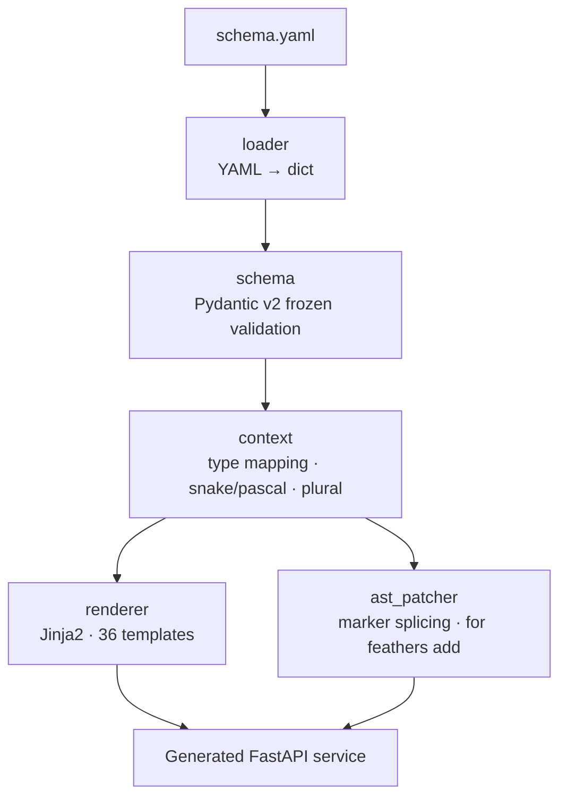
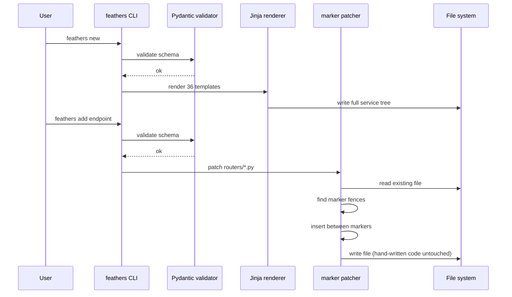
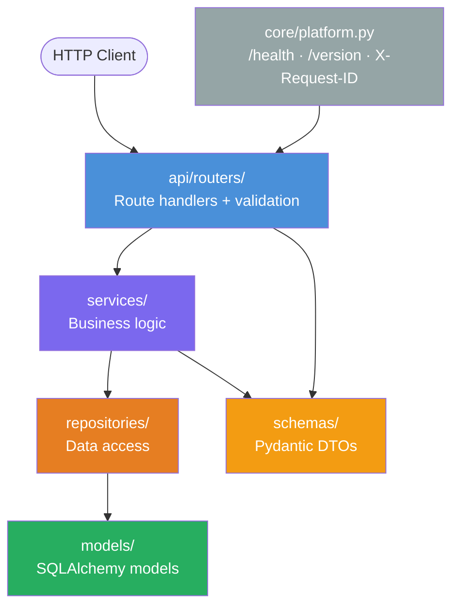
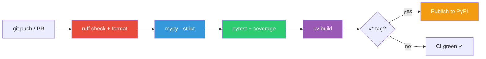

# 🪶 `feathers`

> ⚡ **Scaffold production FastAPI services from one YAML file — in under 10 seconds.**
> Incremental codegen that never clobbers your hand-written code.

🔗 [PyPI](https://pypi.org/project/feathers-cli/) · 📖 [Why](WHY.md) · 🏗️ [Architecture](docs/ARCHITECTURE.md) · 🎬 [Demo](docs/DEMO.md) · 📄 [Schema Example](src/feathers/demos/users.yaml)


---

```console
$ pip install feathers-cli

$ feathers new --schema demos/users.yaml --name hello-users --out .
✔ Validated schema (1 model, 5 endpoints)
✔ Rendered 36 templates
✔ Wrote hello-users/

$ cd hello-users && make run
INFO:     Uvicorn running on http://0.0.0.0:8000
INFO:     Application startup complete.

$ feathers add endpoint --schema demos/users.yaml --service ./hello-users
✔ Patched routers/user.py (hand-written code untouched)
```

---

## 💡 Why this exists

Most scaffolders give you a **dead tree the moment you touch it** — one regeneration and your edits are gone. `feathers` is different:

- **Incremental marker-based codegen** — `feathers add` splices new code into existing services without clobbering a single line you wrote.
- **Fence markers** (`# feathers: begin hand-written`) protect your code forever.
- **Pydantic v2 frozen models** validate every schema before a single file is written — if the schema is wrong, nothing gets generated.
- **One YAML file** produces a fully wired FastAPI service: tests, migrations, observability, CI, Docker, and platform middleware — all production-ready.

---

## ✨ Features

- 🏗️ **Full service generation** — 36 Jinja2 templates produce a complete FastAPI project
- 🗄️ **Real persistence, not stubs** — each model emits a SQLAlchemy ORM table, a Pydantic schema set, an async repository, and CRUD routes wired to a session; the service boots and persists on SQLite out of the box (Postgres via `DATABASE_URL`) and ships with Alembic migrations
- 🔄 **Incremental codegen** — `feathers add endpoint` splices new handlers in via deterministic `# feathers:` markers, with a function-existence check for idempotency
- 🛡️ **Fence markers** — hand-written code between `# feathers: begin hand-written` fences is never touched
- ✅ **Schema-first** — Pydantic v2 frozen models validate YAML before any file is written
- 📊 **Observability built-in** — Prometheus `/metrics` + structlog JSON logging, wired from the schema's `observability` block (each option is honored by the generated code; nothing inert)
- 🐳 **Docker + CI** — Dockerfile, GitHub Actions workflow, Render deploy config
- 🩺 **Health checks** — `/health` and `/version` endpoints with platform middleware
- 🔍 **Schema linting** — `feathers lint` validates without generating
- 🩻 **Doctor command** — `feathers doctor` checks your environment

---

## 🔧 How it works


```mermaid
flowchart TD
    YAML[schema.yaml] --> Loader[loader<br/>YAML → dict]
    Loader --> Schema[schema<br/>Pydantic v2 frozen validation]
    Schema --> Context[context<br/>type mapping · snake/pascal · plural]
    Context --> Renderer[renderer<br/>Jinja2 · 36 templates]
    Context --> Patcher[ast_patcher<br/>marker splicing · for feathers add]
    Renderer --> Service[Generated FastAPI service]
    Patcher --> Service
```

### `new` vs `add`


```mermaid
sequenceDiagram
    participant User
    participant CLI as feathers CLI
    participant Val as Pydantic validator
    participant Gen as Jinja renderer
    participant AST as marker patcher
    participant FS as File system

    User->>CLI: feathers new
    CLI->>Val: validate schema
    Val-->>CLI: ok
    CLI->>Gen: render 36 templates
    Gen->>FS: write full service tree

    User->>CLI: feathers add endpoint
    CLI->>Val: validate schema
    Val-->>CLI: ok
    CLI->>AST: patch routers/*.py
    AST->>FS: read existing file
    AST->>AST: find marker fences
    AST->>AST: insert between markers
    AST->>FS: write file (hand-written code untouched)
```

### Generated service MVC architecture

Every generated service follows strict MVC layering — no layer reaches across:


```mermaid
flowchart TD
    Client([HTTP Client]) --> Router[api/routers/<br/>Route handlers + validation]
    Router --> Service[services/<br/>Business logic]
    Service --> Repo[repositories/<br/>Data access]
    Repo --> Model[models/<br/>SQLAlchemy models]
    Router --> Schema[schemas/<br/>Pydantic DTOs]
    Service --> Schema
    Platform[core/platform.py<br/>/health · /version · X-Request-ID] --> Router

    style Router fill:#4A90D9,color:#fff
    style Service fill:#7B68EE,color:#fff
    style Repo fill:#E67E22,color:#fff
    style Model fill:#27AE60,color:#fff
    style Schema fill:#F39C12,color:#fff
    style Platform fill:#95A5A6,color:#fff
```

### CI/CD pipeline


```mermaid
flowchart LR
    Push[git push / PR] --> Lint[ruff check + format]
    Lint --> Types[mypy --strict]
    Types --> Test[pytest + coverage]
    Test --> Build[uv build]
    Build --> Publish{v* tag?}
    Publish -->|yes| PyPI[Publish to PyPI]
    Publish -->|no| Done[CI green ✓]

    style Lint fill:#E74C3C,color:#fff
    style Types fill:#3498DB,color:#fff
    style Test fill:#2ECC71,color:#fff
    style Build fill:#9B59B6,color:#fff
    style PyPI fill:#F39C12,color:#fff
```

See [`docs/ARCHITECTURE.md`](docs/ARCHITECTURE.md) for the deep dive.

---

## 📄 Schema anatomy

```yaml
service:
  name: hello_users
  description: A minimal users service
  python: "3.12"

models:
  - name: User
    fields:
      - { name: id,       type: uuid,     primary: true }
      - { name: email,    type: str,      unique: true, indexed: true }
      - { name: name,     type: str }
      - { name: created,  type: datetime }
    soft_delete: true
    audit: true

endpoints:
  # handler is "<plural_snake>.<crud verb>" — it must match the model's table
  # (User → users) for the CRUD route to be generated.
  - { method: GET,  path: /users/{id}, handler: users.get,    auth: any }
  - { method: POST, path: /users,      handler: users.create, auth: admin }
  - { method: GET,  path: /users,      handler: users.list,   auth: any, paginate: cursor }

observability:
  metrics: prometheus
  logging: structlog

deploy:
  health: /health
```

`auth:` roles are enforced per-route by the generated `require_role` dependency
(active when `DEMO_MODE=false` and a bastion key is configured; fail-open
otherwise). `paginate: cursor` generates keyset pagination on the primary key;
`offset` (or `none`) generates offset pagination. Both cap `limit` at 100.

Every field is validated by **frozen Pydantic v2 models** — if the schema is wrong, `feathers` refuses to write a single file.

---

## 📁 Project structure

```
feathers/
├── src/feathers/
│   ├── cli.py                       # Typer CLI entry point
│   ├── bench.py                     # generation-throughput benchmark (feathers bench)
│   ├── generator/
│   │   ├── ast_patcher.py           # marker-based splicing for feathers add
│   │   ├── codegen.py               # SQLAlchemy/Pydantic source fragments per field
│   │   ├── context.py               # Type mapping, naming transforms
│   │   └── renderer.py              # Jinja2 template rendering
│   ├── schema/
│   │   ├── loader.py                # YAML → dict I/O
│   │   ├── service.py               # Pydantic v2 frozen models
│   │   └── errors.py                # Schema validation errors
│   ├── templates/service/           # 36 Jinja2 templates
│   │   ├── src/                     # App, routers, services, repos, models, schemas
│   │   ├── tests/                   # Generated test files
│   │   ├── Dockerfile.j2
│   │   ├── Makefile.j2
│   │   ├── pyproject.toml.j2
│   │   ├── ci.yml.j2
│   │   └── render.yaml.j2
│   └── demos/                       # Example YAML schemas
├── tests/
│   ├── test_smoke.py                # packaging: __version__ matches installed metadata
│   ├── unit/
│   │   ├── test_ast_patcher.py
│   │   ├── test_bench.py
│   │   ├── test_cli.py
│   │   ├── test_codegen.py
│   │   ├── test_context.py
│   │   ├── test_generated_wiring.py # asserts the rendered output is really wired
│   │   ├── test_renderer.py
│   │   └── test_schema.py
│   ├── integration/
│   │   └── test_postgres_service.py # Testcontainers Postgres: alembic + real CRUD
│   └── e2e/
│       └── test_generate_and_run.py # Generates service, boots it, hits /health
├── .github/dependabot.yml
├── .github/workflows/ci.yml
├── Makefile
├── pyproject.toml
└── WHY.md
```

### Generated service layout

```
hello-users/
├── src/hello_users/
│   ├── main.py                  # FastAPI app + middleware
│   ├── api/routers/             # One CRUD router per model
│   ├── services/                # Business-logic layer (the seam for your rules)
│   ├── repositories/            # Async SQLAlchemy data access
│   ├── models/                  # SQLAlchemy ORM models
│   ├── schemas/                 # Pydantic Create/Update/Response DTOs
│   └── core/
│       ├── config.py            # pydantic-settings (DATABASE_URL, DEMO_MODE, CORS…)
│       ├── db.py                # async engine + session dependency (SQLite default)
│       ├── platform.py          # /health, /version, X-Request-ID, /metrics
│       └── platform_token.py    # X-Platform-Token verification + require_role
├── alembic/                     # migration env + 0001 initial schema
├── alembic.ini
├── tests/
│   ├── test_health.py
│   ├── test_platform_token.py   # X-Platform-Token + require_role enforcement
│   └── test_<model>s.py         # generated CRUD test
├── .github/workflows/ci.yml     # lint → test → build
├── Dockerfile
├── Makefile                     # make run | test
├── render.yaml                  # one-click Render deploy
└── pyproject.toml               # uv-managed
```

---

## 💻 CLI reference

| Command | Purpose |
|---|---|
| `feathers new --schema FILE --name NAME --out DIR` | Generate a new service from a schema |
| `feathers add endpoint --schema FILE --service DIR` | Slot a new endpoint into an existing service |
| `feathers add model --schema FILE --service DIR` | Write a bare model-stub file to fill in by hand (not wired into the app — unlike `feathers new`) |
| `feathers lint SCHEMA` | Validate a YAML schema without generating |
| `feathers doctor` | Environment health check (Python, uv) |
| `feathers bench [-n N]` | Measure generation throughput by scaffolding the demo schema N times (default 50) |

### Why it's different

| Most scaffolders | `feathers` |
|---|---|
| Cookiecutter templates — stale after first edit | **Incremental marker-based codegen** — regeneration stays safe forever |
| String templating | **Pydantic v2 schema** validated before any file is written |
| Hand-wired middleware per service | **Platform middleware** shipped with every generated service |
| You protect your edits with prayer | **Fence markers** — regen never touches protected regions |
| Pick your own stack | **Opinionated & consistent** — FastAPI + uv + Alembic + structlog + Prometheus |

---

## 🧱 Stack

| Concern | Choice |
|---|---|
| CLI framework | **Typer** |
| YAML validation | **Pydantic v2** (frozen models) |
| Template engine | **Jinja2** (36 templates per service) |
| Incremental codegen | **marker-based splicing** (`# feathers:` fences) |
| Package manager | **uv** |
| Lint / Types | **ruff** + **mypy strict** |
| Tests | **pytest** + coverage |

---

## 🧪 Testing

```bash
make test                                  # full suite
uv run pytest --cov=src/feathers --cov-report=term-missing
make test-fast                             # skip e2e boot + Postgres containers
make test-integration                      # generated service vs. real Postgres
```

| Metric | Value |
|---|---|
| **Test count** | 131 tests |
| **Coverage** | **100%** line + branch (`--cov-branch`) |
| **E2E** | `@pytest.mark.slow` — generates the users service, `uv sync`, boots uvicorn, hits `/health` |
| **Integration** | `@pytest.mark.integration` — Testcontainers Postgres: `alembic upgrade head`, then real CRUD, soft delete and keyset pagination against the container ([spec](docs/specs/05-postgres-integration.md)) |
| **CI** | GitHub Actions: ruff → mypy → pytest → integration → `uv build` |

---

## 🏛️ Engineering philosophy

| Principle | How it shows up |
|---|---|
| 🔴 **Spec-TDD** | 131 tests across loader, schema, renderer, codegen, AST patcher, CLI, and generated-service wiring. Red-first. |
| 🚫 **Negative-space programming** | `Literal` types for field types, HTTP methods, auth roles. Frozen Pydantic models. Schema validation rejects invalid input before any file is written. |
| 🏗️ **MVC-style layering** | `cli → generator → schema`. Each layer has one responsibility and never reaches across. |
| 🔒 **Typed everything** | `mypy --strict` passes. The context↔codegen field contract is a typed `FieldView` (no untyped dicts across that boundary); `Any` appears only at the YAML-parse edge and in the heterogeneous Jinja render context. Public APIs fully type-hinted. |
| 🧊 **Pure core, imperative shell** | Schema validation, context building, and rendering are pure. File I/O lives only in the CLI entry points. |
| 📦 **One responsibility per module** | `loader` (I/O), `service` (schema defs), `context` (view transforms), `renderer` (Jinja), `ast_patcher` (marker splicing). |

---

## 🚀 Deploy

- **`feathers-cli` itself** → published to [PyPI](https://pypi.org/project/feathers-cli/) on `v*` tag push via GitHub Actions
- **Generated services** → ship a **Render blueprint** (`render.yaml`) backed by the generated **Dockerfile**, so they deploy to **Render** or any Docker host

### Benchmarks

| Metric | Result | Source |
|---|---|---|
| Service scaffolded from schema | ~37 ms (median) | `feathers bench` · [benchmarks/report.md](benchmarks/report.md) |
| Generated `GET /users/{id}` throughput | **not yet measured** | needs a load-test harness (see below) |
| Generated `GET /users/{id}` p99 latency | **not yet measured** | needs a load-test harness (see below) |

`feathers bench` measures **generation speed** today: it scaffolds the demo
schema repeatedly and reports median/p95 ms per generation and generations per
second. It needs no database or network. The generated service is now
DB-backed (real SQLAlchemy CRUD on SQLite/Postgres), so a request-throughput
and latency benchmark is achievable — but it is **not yet measured**; a
Locust-driven load-test mode of `feathers bench` is the next step, and no RPS
figure is claimed until it runs. Generation-speed numbers are machine-dependent
— see [benchmarks/report.md](benchmarks/report.md).

---

## 📜 License

MIT — see [LICENSE](LICENSE).

---

> 🪶 *Built to make regenerating FastAPI services boring.*
