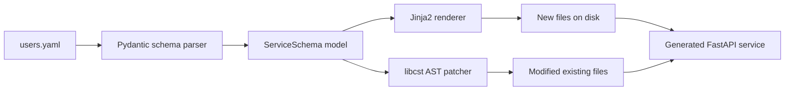

# Architecture

## Flow

## Component map

| Module | Responsibility |
|---|---|
| `feathers.cli` | Typer root; wires subcommands |
| `feathers.commands.*` | One file per subcommand (`new`, `add`, `lint`, `bench`, `doctor`) |
| `feathers.schema.*` | Pydantic v2 models that validate user YAML before any file is touched |
| `feathers.generator.renderer` | Jinja2 template rendering + idempotent file writer |
| `feathers.generator.ast_patcher` | libcst-based incremental rewrite for `feathers add` |
| `feathers.generator.context` | Builds the Jinja render context from a `ServiceSchema` |
| `feathers.templates.service` | Jinja2 templates that produce the generated FastAPI service |
| `feathers.demos` | Example YAML schemas shipped with the package |

## Generated service layout

See [the spec](../../../docs/projects/10-feathers.md#generated-project-layout) for the
full tree. Every generated service follows strict MVC layering:
`routers → services → repositories → models`, with `schemas/` for DTOs and `core/` for
cross-cutting plumbing (config, db, security, telemetry, platform middleware).
