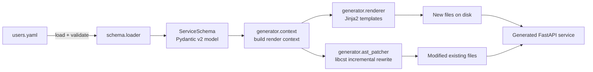
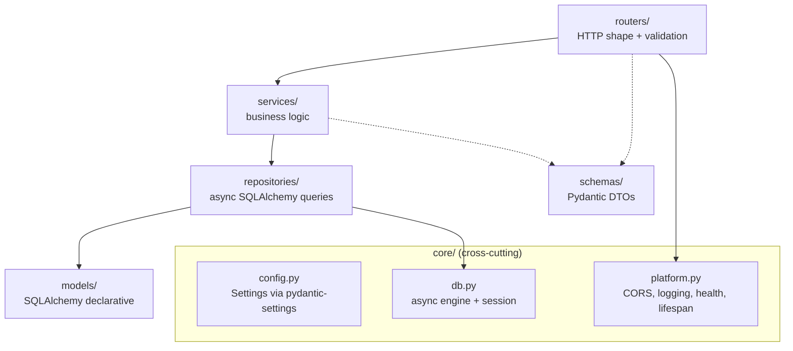
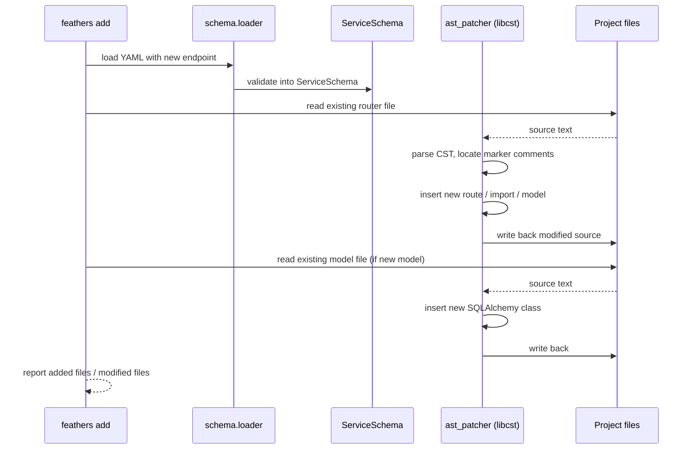

# Architecture

## Pipeline overview

The CLI accepts a YAML service definition, validates it into a typed Pydantic model,
then either scaffolds a brand-new project (`feathers new`) or incrementally patches
an existing one (`feathers add`).

## Component map

| Module | Responsibility |
|---|---|
| `feathers.cli` | Typer root; wires subcommands (`new`, `add`, `lint`, `bench`, `doctor`) |
| `feathers.commands.*` | One file per subcommand; each receives a validated `ServiceSchema` |
| `feathers.schema.loader` | Reads YAML from disk, resolves includes, returns raw dict |
| `feathers.schema.service` | Pydantic v2 `ServiceSchema` model tree -- validates every field before any file I/O |
| `feathers.schema.errors` | Structured validation errors with source-location context |
| `feathers.generator.context` | Transforms a `ServiceSchema` into the flat dict Jinja2 templates consume |
| `feathers.generator.renderer` | Jinja2 environment setup, template lookup, idempotent file writer (skip if unchanged) |
| `feathers.generator.ast_patcher` | libcst-based incremental rewrite for `feathers add` -- inserts routes, models, imports without clobbering hand-written code |
| `feathers.templates.service` | 21 Jinja2 `.j2` templates producing the generated FastAPI project |
| `feathers.demos` | Example YAML schemas shipped with the package (e.g. `users.yaml`) |

## Generated service architecture

Every scaffolded project follows strict MVC layering:

## Template manifest

21 Jinja2 templates organized by category:

| Category | Templates | Purpose |
|---|---|---|
| **Project-level** | `pyproject.toml.j2`, `Makefile.j2`, `Dockerfile.j2`, `render.yaml.j2`, `ci.yml.j2`, `README.md.j2`, `.env.example.j2`, `.gitignore.j2`, `.python-version.j2` | Build config, CI/CD, deployment, docs |
| **Application** | `src/main.py.j2`, `src/__init__.py.j2`, `src/api/__init__.py.j2` | FastAPI app factory + API package init |
| **Per-model** | `src/api/routers/router.py.j2`, `src/api/routers/__init__.py.j2`, `src/models/model.py.j2`, `src/models/__init__.py.j2` | One router + one model file per YAML model definition |
| **Core / infra** | `src/core/__init__.py.j2`, `src/core/config.py.j2`, `src/core/platform.py.j2` | Settings, DB engine, platform middleware |
| **Tests** | `tests/__init__.py.j2`, `tests/test_health.py.j2` | Smoke test scaffold |

## Incremental codegen flow (`feathers add endpoint`)

## Layering invariants

1. **Routers never import models** -- they depend only on schemas (DTOs) and services.
2. **Services never import `fastapi`** -- they receive plain typed args, return plain typed results.
3. **Repositories never know about HTTP** -- they accept/return SQLAlchemy models or primitives.
4. **Core imports nothing from the layers above** -- it provides config, DB sessions, and middleware.
5. **No circular imports** -- the dependency graph is strictly `routers -> services -> repositories -> models`, with `schemas` and `core` as side dependencies.
6. **Templates are read-only at runtime** -- `feathers add` never modifies templates; it patches generated output via libcst.
